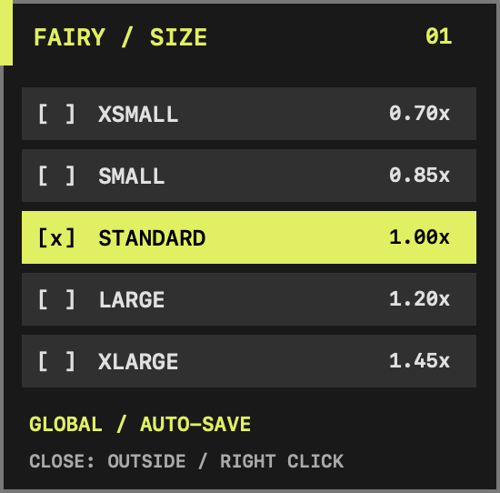
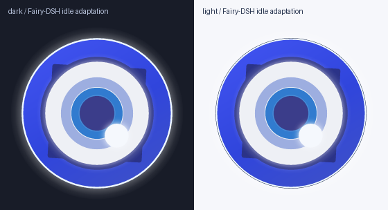

# Fairy 动画模块 — 仅 macOS 桌面

集成版保留共享原生桌宠、完整/简洁开场、音效、全局大小/位置、自动系统外观和休息提醒。
终端矢量/像素渲染及 Kitty/widget 实现已移除；非 macOS 明确不支持桌面，Pi 与语音仍可用。
SVG 是可编辑美术源，不是已移除的终端后端；原生桌面继续使用全部 240 张 PNG。
视觉适配归属见 [LICENSES.md](LICENSES.md)、[NOTICE](NOTICE)。

## 命令

```text
/fairy-anim help
/fairy-anim on
/fairy-anim off
/fairy-anim toggle
/fairy-anim welcome
/fairy-anim welcome full
/fairy-anim welcome simple
```

开关仅影响本 Pi 桌面连接，不写磁盘。桌面自动跟随 macOS 系统外观，无手动外观命令。
welcome 查询或保存下一次共享桌面生命周期的开场选择，不启动或重播桌面。
full 保留完整 HDD 开场 V1、SFX v4 和 welcome7；simple 为 2.4 秒中心生长/落位，使用 welcome1–6。
两种开场回到保存的位置，退场统一微放大后原地收缩淡出。
直接注册动画模块保持静音；集成规则见 [桌面开场](../../docs/DESKTOP-INTRO.md)、
[共享音频](../../docs/LIFECYCLE-AUDIO.md)、[休息提醒](../../docs/REST-REMINDER.md)。

## macOS 桌面运行方式

- 只有交互式 Pi (`ctx.mode=tui`) 连接。`PI_SUBAGENT_CHILD` 排除 pi-subagents 子进程；
  不使用 root 也设置的 `PI_SUBAGENT_PARENT_SESSION`，不写继承性标记、不扫描进程。
- 一个原生 Swift/AppKit 进程拥有窗口、Unix socket 与连接计数；没有 Node broker、
  Electron、网络端口、任务事件订阅、登录项或后台自动启动；集成版共享声音由此 owner 播放。Pi 退出/崩溃自动断开。
  任意 Pi 可首先启动，后续共享；最后一个启用桌面的连接断开后有 **3秒**宽限，再退场并等待共享音频结束。
  reload 重叠/短暂断开保留同一窗口与动画时钟。进程 detached，stdio 为 `/dev/null`。
- **on/off/toggle 只改变当前 Pi 的桌面连接**。off 不杀其它 Pi 的 Fairy；若是最后一个，
  图片在3秒宽限期后开始退场。
- **桌面自动跟随 macOS 系统外观**，不取 Pi 主题；双主题美术、coolblue 交互配色与开场不变。
  旧手动外观命令仅提示用法，不连接桌面或改变显示状态。新连接不发送外观覆盖。
  若存活的旧 helper 仍保留手动覆盖，需退出所有 Pi，等共享 helper 结束后再重启 Pi，
  新 helper 默认恢复 auto；仅 `/reload` 不重置旧 helper，更新也不会主动重置它。
- 左键按住 Fairy 可自由拖动；非激活透明 NSPanel，不抢键盘焦点，无 Dock 图标/阴影；statusBar 窗口层级，
  为接收拖动，待机桌宠窗口范围不再点击穿透。完成拖动后保存位置，集成版下次开场回到该位置。
  `canJoinAllSpaces/fullScreenAuxiliary`。不申请辅助功能/录屏权限。
  macOS 可限制全屏、受保护窗口或系统界面上的显示，**尚需人工 Spaces/全屏验收**。
- 启动时选鼠标所在屏幕（否则第一屏），使用该屏 `visibleFrame`，中心在80%宽/从顶部1/3高。
  AppKit 坐标从底部计算并夹紧边界；standard 为238逻辑点透明画布、约200点圆盘；其它尺寸见下表。不会跟随鼠标移动。
  6秒/120帧/20FPS，读取现有双主题 PNG；没有终端入场飞行、故障或实时SVG引擎。
- 首次使用异步调用系统 `/usr/bin/swiftc -O`（需要可用 Xcode/Command Line Tools SDK），
  不阻塞 Pi 启动，不下载依赖。源文件 `native/Fairy.swift` 可编辑；源哈希+架构命名的
  二进制缓存于私有 `/tmp/pi-fairy-UID/`，不进仓库。并发编译独立临时文件后原子 rename。
  编译上限120秒，连接重试上限10秒；同一客户端至多3次启动、2次崩溃重连。
  失败以中文通知，不提供终端回退；off/on 可重新连接，编译失败需
  修复SDK后 `/reload`。不自动安装SDK，不修改系统权限。
- 目录须为本人所有且0700；socket仅本用户可访问。持久 lock inode 的 OS flock
  排他锁覆盖 socket 清理/服务全生命周期，**退出不删除lock文件**。只有持锁者可回收
  拒绝连接的陈旧socket；活跃外来socket绝不删除。64连接上限、256字节缓冲限制，
  只接受具名theme行命令；EOF/错误释放连接，SIGKILL由内核释放锁。

### 右键尺寸菜单（仅桌面）

右键 Fairy 打开原创 HDD 风格紧凑面板：炭黑底、冷蓝选中条、等宽标签与 `[x]`。
无需先激活 Fairy，左键选项立即改变共享桌宠尺寸；成功保存后关闭菜单。
再次右键（Fairy 或菜单）、点击其它位置、开始拖动 Fairy 都关闭菜单。
菜单和桌宠均不成为 key/main window；**不支持 Escape**，键盘仍归当前应用。
仅菜单打开期间注册 AppKit 鼠标点击 monitor，关闭即移除；不使用全局 event tap、
键盘监听、光标轮询，不申请辅助功能/输入监控权限。若系统不提供外部点击通知，
再次右键仍可关闭。菜单不暂停动画、连接服务或退出宽限期。

| 预设 | 倍率 | 透明画布（逻辑点） |
| --- | --- | --- |
| xsmall | 0.70 | 166.6 |
| small | 0.85 | 202.3 |
| standard | 1.00 | 238 |
| large | 1.20 | 285.6 |
| xlarge | 1.45 | 345.1 |

尺寸围绕**当前位置中心**改变，并夹紧当前窗口所在屏幕的 `visibleFrame`；极小屏幕进一步缩小。
0.7.0 的集成开场优先使用保存的显示器 UUID 和可见区域相对中心；未保存时默认右上角。
显示器缺失时安全回退并夹紧边界，不用临时回退坐标覆盖记住的位置。
设置仍保存在 `~/Library/Application Support/pi-fairy-animation/settings.json`：
v2 含 `size`、`welcome` 和可选 `position: {display, x, y}`，原子写入并保留独立字段；
v1 尺寸会在成功写入时迁移。缺失/损坏数据安全回退，默认 standard/full。
拖动后保存；退场前对有来源的静止位置作一次尽力保存，不保存动画中间坐标。
写盘失败可在菜单警告处重试；最终仍不可写时无法保证记住位置。源哈希更新不重置此文件。
保存失败仍应用当前进程大小，菜单显示 **NOT SAVED / CLICK TO RETRY** 并保留当前选中项；
再次点击可重试。不声称失败的写入已持久化；生产 helper stderr 被丢弃，所以面板提示是主要反馈。

**更新已运行的共享 helper：** `/reload` 不替换仍存活的旧 helper。请在所有连接 Pi 中
`/fairy-anim off`（或退出），等最后连接断开超过3秒，再 on；不要杀别人的 helper。
新进程自动构建新源哈希并读取同一偏好。仅 reload 时，旧进程会保留原行为。



后端选项已移除；旧 `--fairy-anim-mode` 参数仅作拒绝迁移保护，任意值都会禁止本次桌面连接。请删除该参数后重启。

可选 GUI 检查从包根目录运行 `npm run smoke:desktop`，会短暂显示桌宠。
它不替代真实拖动、焦点、多屏/Spaces 验证；屏幕布局运行中改变暂不重新定位。

## 桌面美术资源



[待机美术 GIF](docs/vector-idle.gif)；运行时使用透明 PNG，无实时 SVG 渲染。

## 自己调整形象

编辑 **`assets/fairy.svg`**，直接用浏览器或矢量图编辑器查看。主要层：
`outer-disc`、`outer-halo`、`corners`、`sclera`、`iris-outer`、`iris-blue`、`pupil`、
`highlight`。**`assets/idle-motion.json`** 独立控制呼吸周期、旋转周期、Bezier、
四层尺度与相位领先，适合以后手工做其它待机版本；没有运行时动画框架。

```sh
cd /path/to/pi-fairy
npm run build:frames
python3 modules/animation/scripts/build-previews.py  # Pillow，重建双主题 PNG/GIF 预览
npm test
python3 modules/animation/tests/check-assets.py
# 然后回到 Pi /reload
```

保留生成器检查的具名 transform 锚点与支持描边占位色 `#dceaff`；缺失/重复会报错。
参数必须在6秒内完成整数次呼吸与整数个90°旋转，生成器拒绝不闭合组合。
resvg 只用于**离线生成**，日常 Pi 只读取本包 PNG，不绘图、不联网。
保留修改文件中的归属声明；单独分发生成图片时也需附带 NOTICE 与 Apache 许可证。

## 验证

从集成包根目录运行资源检查及私有启动测试：

```sh
npm run check:assets
npm run test:startup-entry
```

后者仅使用私有 headless 原生进程、静音桩及 PTY，验证启动租约、exec、描述符与 job-control。
GUI smoke 是另行显式选择的人工检查，不是静默测试。
本发行不包含原像素/终端实现，不提供运行时回退。
桌面待机效果见 [DESKTOP-IDLE-EFFECTS.md](docs/DESKTOP-IDLE-EFFECTS.md)。
